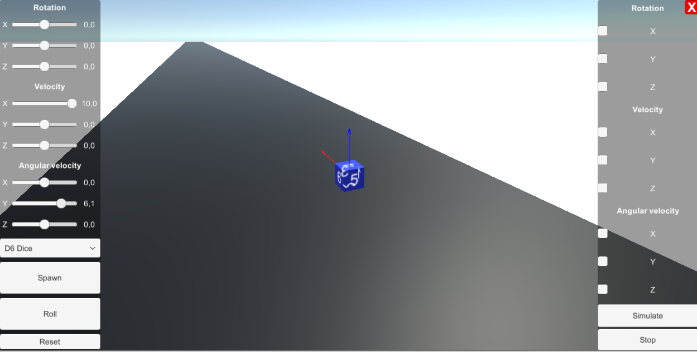
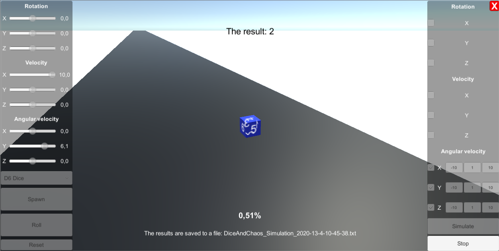
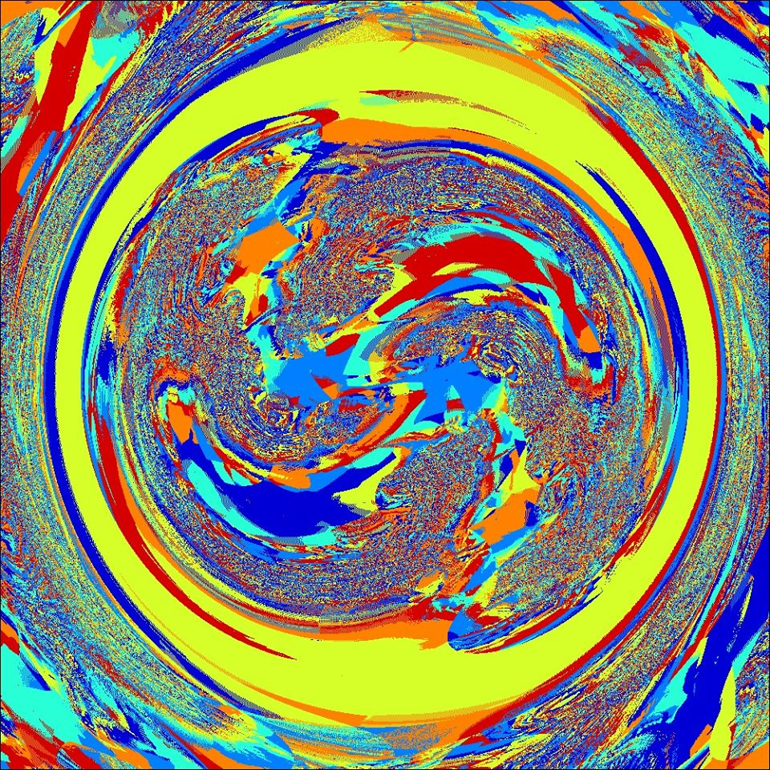
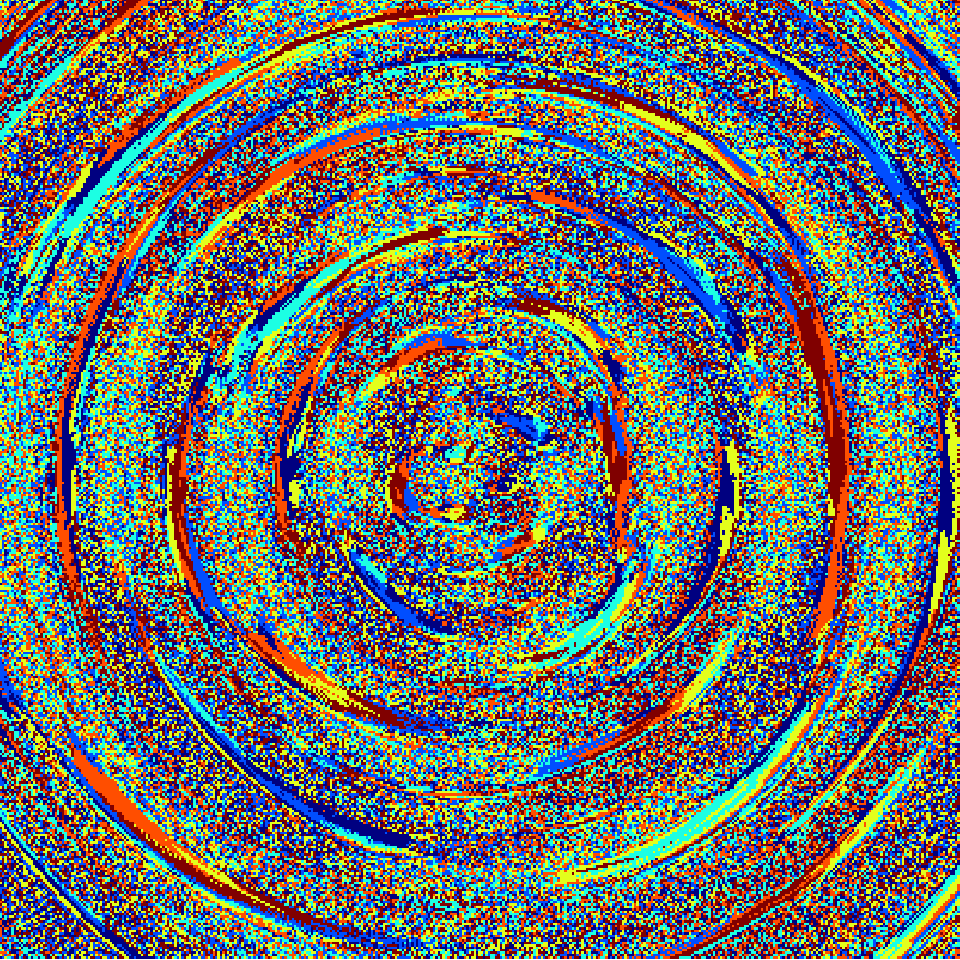

# DiceAndChaos

## Table of contents

- [DiceAndChaos](#diceandchaos)
  - [Table of contents](#table-of-contents)
  - [Builds](#builds)
  - [Preview](#preview)
  - [Gallery](#gallery)
  - [TODO](#todo)

It is the common fact that chaotic behavior can emerge in classical physics. In the repository, one can find a simulator of the rolling dice using Unity game physics. Users can change initial conditions for each roll.

## Builds

- [**Download Windows Build**](https://github.com/andywiecko/DiceAndChaos/releases/download/v1.0/v1-0.zip)

## Preview

Note: red and blue arrow correspond to velocity and angular velocity vector, respectively.

## Gallery

Below one can find the results obtained by the following repo.
OX and OY axis coresponds to different initial conditions and pixel color represent the result (face of the die after simulation) for such conditions.

## TODO

- Implement different dice
  - D12
  - D20
  - ...
